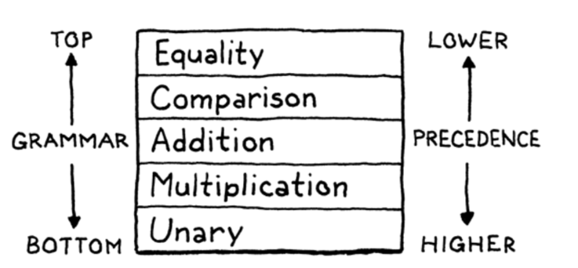
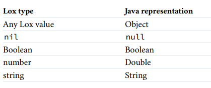

# Part#1 总览

## Chap#01 介绍

#### Languages

DSL（Domain-Specific Language， "Little Languages"）

- Make, YMAL, XML, HTML, Batch, Emacs-Lisp, JSON
- ...

应用场景

- Documentation, Debugger, Editor Support, Syntax Highlighting

#### The First Interpreter

>  jlox in Java

自举（Bootstrapping）

>  You can use the compiled version of your own compiler to compile future versions of itself, and you can discard the original one compiled from the other compiler.

#### The Second Interpreter

> clox in C

C实现的语言

- Lua, CPython, Ruby's MRI...

计划功能

- 高级数据结构：动态数组、哈希表……
- 规划对象（Object）的内存结构
- 垃圾回收期（Garbage Collector）
- 将脚本转为字节码（Bytecode）

## Chap#02 路线图


#### 源代码（Source Code）

​	纯文本


### Section#1 Front End

#### 扫描（Scanning，也叫词法分析：lexing/lexing analysis）

​	词法分析器（Scanner/Lexer）以线性流的方式读取源代码中的字符，将他们切分为一个一个的词法单元（Token）。


#### 解释（Parsing，也叫语法分析）

​	语法（Grammar）$G = (V_T, V_N, P, S)$

- Wikipedia: https://zh.wikipedia.org/zh/%E8%AF%AD%E6%B3%95

- 狭义：词如何组成短语和句子，即语法结构——这一部分严格意义称为句法（Syntax）
- 广义：对语法规则进行总结描述，或对语言使用的规范和限定，即语法规则

​	解释器（Parser）以词法单元序列作为输入，以树状结构的抽象语法树（Abstract Syntax Tree）作为输出。

​	解释器还承担了报告语法错误的任务（Syntax Error）。


#### 静态分析（Static Analysis）

​	Step#1 绑定（Binding/Resolution）

​	找到语句中标识符（Identifier，Token的一种，如“a+b”中的a）的声明（Declaration，如a=10）处，将二者绑定（此处大概只是Name Binding），通识要注意绑定受作用域（Scope）限制，某个名称标识符只能绑定到该作用域下的一个声明。

- 对于静态类型（Statically Typed）的语言来说，绑定中需要发现类型错误。

​	Step#2 记录绑定结果

- 作为属性保存到AST的节点上
- 符号表：以标识符作为key

### 	Section#2 Middle End 

#### 中间语言 (IR, Intermediate representation)

​	作为一个处在源语言和目标语言之间的接口，实现多源语言和多目标平台。

#### 优化（Optimization）

Wikipedia: https://en.wikipedia.org/wiki/Template:Compiler_optimizations

**O#1 常量叠算（Constant Folding）**

- 例

  ```c++
  // from 
  double a = 3.14159 * (0.75 / 2) * (0.75 /2);
  // to   
  double a = 0.4417860938;
  ```

- 在编译时计算常数计算并替代之

**O#2 常量传播（Constant Propagation ）**

- 例

  ```c++
  // Before
  int x = 14;
  int y = 7 - x / 2;
  return y * (28 / x + 2);
  // After
  int x = 14;
  int y = 0;
  return 0;
  ```

- 替代表示式中已知常数的过程，具体的传播路径由定义可达性（Reaching Definition）分析，重复多次常量传播+常量叠算的处理后，再进行死码清除（Dead Code Elimination）。

- 定义可达性

  ```c++
  // Case#1
  int x = 3; // d1
  int y = x; // d2
  //	d2 -----> d1
  // Case#2
  int x = 3;  // d1
  int x = 4;  // d2
  int y = x;  // d3
  //	d3 --X--> d1
  ```

  - 以表达式`p=a*b+c`为例，若1. 从初始节点到p处，计算过`a*b`且计算过后a和b没有被重新赋值，则认为该表达式在p点是可达的。

- 死码删除

  ```c++
  // Before:
  int a = 30;
  int b = 20;
  int c = 12;
  if (true) c = 2;
  return c * 2;
  // After:
  int c = 12;
  if (true) c = 2;
  return c * 2;
  ```

**O#03 公共子表达式删除(Common Subexpression Elimination)**

- 基于定义可达性，编译器将多个相同的表达式替换成一个变量

- 例

  ```c++
  // Before
  int a = b * c + g;
  int d = b * c + e;
  // After
  int temp = b * c;
  int a = temp + g;
  int d = temp + e;
  ```

**O#04 循环不变代码外提 (LICM, Loop-Invariant Code Motion, also know as hoisting or scalar promotion)**

- 将循环不变的语句或表达式移到循环体之外，而不改变程序的语义。

- 例

  ```c++
  // From:
  for (int i = 0; i < n; i++) {
      x = y + z;
      a[i] = 6 * i + x * x;
  }
  // After:
  x = y + z;
  t1 = x * x;
  for (int i = 0; i < n; i++) {
      a[i] = 6 * i + t1;
  }
  ```

**O#05 值编号(Value Numbering)**

- 例

  ```
  a := 3         a #1
  b := a         b #1
  c := a + b     c #2
  d := c         d #2
  ```

- 以全局(GVN)和局部的值编号进行区分

- 静态单赋值形式(SSA, Static Single Assignment Form)

  - 例

    ```
    // Normal
    y := 1
    y := 2
    x := y
    // SSA Form
    y1 := 1
    y2 := 2
    x  := y2
    ```

  - 中间语言的一种特性，每个变量仅被赋值一次， 许多编译器优化都是在使用SSA的基础上实现的

  - Wikipedia: https://en.wikipedia.org/wiki/Static_single-assignment_form

**O#06 强度折减(Strength Reduction)**

- 意在以等效但运算量小的计算替代昂贵的计算

- 例：

  - 用循环及加法取代乘法运算

    ```c++
    // Before
    c = 8;
    for (i = 0; i < N; i++)
    {
    	y[i] = c * i;
    }
    // After
    c = 8;
    k = 0;
    for (i = 0; i < N; i++)
    {
        y[i] = k;
        k = k + c;
    }
    ```

  - 逻辑位移运算子

    `y = x/8 ==> y = x >> 3`

**O#07 循环展开（Loop unrolling）**

- 牺牲程序的大小来加快程序执行速度

- 例

  ```c++
  for (int i = 1; i <= 60; i++)
  	a[i] = a[i] * b * c;
  
  for (int i = 1; i <= 58; i+= 3) {
  	a[i] = a[i] * b * c;
  	a[i + 1] = a[i + 1] * b * c;
  	a[i + 2] = a[i + 2] * b * c;
  }
  ```

### Section#3 Back End 

#### 代码生成(Code Generation)

设计决策：机器码还是字节码

- 机器码是对应平台/架构的原生代码，生成复杂但运行高速
- 字节码针对虚拟的CPU，指令通常一个字节大小，可移植性强但运行速度略慢

#### 虚拟机(Virtual Machine)

​	直观的思路是将源代码翻译为Bytecode后还需要编写“迷你编译器”来将字节码翻译到对应平台的机器码。

​	但我们也可以编写一个虚拟机，例如编写一个C语言的虚拟机，我们就可以在任何有C编译器的平台运行代码。

#### 运行时（Runtime）

​	为运行中的程序提供的服务，包内存管理（如使用GC，回收不再使用的内存）和运行类型信息（RTTI，使得部分对象实例在运行时才决定其具体类型）

### Section#4 捷径

#### 一次通过编译器(Single-Pass Compiler)

​	编译器的各个部分只通过一遍后就生成机器码

#### 语法树遍历解释器(Tree-Walk Interpreters)

​	在遍历语法树的过程中就对每个节点进行计算

#### 转译器(Transpilers)

​	从一种编程语言翻译到另一个等效源代码的编译器

​	将浏览器视为现代“机器”的话，JS则时它的“机器码”，因此也出现了许多转译到JS的转译器

#### 即时编译(JTT，Just-in-time Compilation)

​	JIT读取提前编译的字节码，动态地将他们编译为机器码

### Section#5 对比：编译器与解释器

编译：将源语言翻译为其他形式（不同层级，通常时更底层，如字节码和机器码）

解释：读取源语言然后直接执行


# Part#2 语法树遍历解释器

## 【TODO】Chap#03 扫描（词法分析）

#### 词汇语法(Lexical Grammar)

即是描述如何由字符组合出词法单位(Lexeme)， 扫描器的关键就是根据我们设定的词汇语法规则，分析输入的字符流，解析成一些列标识符。

#### 入口

Lox#main

```java
public static void main(String[] args) throws IOException {
    if (args.length > 1) {
        System.out.println("Usage: jlox [script]");
        System.exit(64);
    } else if (args.length == 1) {
        runFile(args[0]);
    } else {
        runPrompt();
    }
}
```

#### 标识符类

```java
public class Token {
    final TokenType type;
    final String lexeme;
    final Object literal;
    final int line;

    Token(TokenType type, String lexeme, Object literal, int line) {
        this.type = type;
        this.lexeme = lexeme;
        this.literal = literal;
        this.line = line;
    }

    public String toString() {
        return type + " " + lexeme + " " + literal;
    }
}
```

标识符类保存的信息在解析器（Parser），“解释器”（Interpreter，程序运行）类以及报错均有大量使用。

#### 扫描器

Scanner#scanToken

```java
private void scanToken() {
    char c = advance();
    switch(c) {
        // single-character lexemes
        case '(': addToken(LEFT_PAREN); break;
        // ...

		// single-character lexemes
        case '!': addToken(match('=') ? BANG_EQUAL : BANG); break;
        case '=': addToken(match('=') ? EQUAL_EQUAL : EQUAL); break;
        case '<': addToken(match('=') ? GREATER_EQUAL : GREATER); break;
        case '>': addToken(match('=') ? LESS_EQUAL : LESS); break;

		// @fixme
		// - We should treat the newlines differently in File-run mode and Prompt-run mode.
		// - There should support stuff like '^' as a newline in Prompt-run mode.
		// Division or Comment
        case '/':
            if (match('/')) { // If it's a line-comment, consume the whole line.
                while (peek() != '\n' && !isAtEnd()) advance();
            } else if (match('*')) { // Block comments
                blockComment();
            } else {
                addToken(SLASH);
            }
            break;

            // Other meaningless characters
        case ' ':
        case '\r':
        case '\t':
            break;

            // Finished current line.
        case '\n': line++; break;

            // Literals
        case '"': string(); break;

        default: {
            if (isDigit(c)) {
                number();
            } else if (isAlpha(c)) {
                identifier();
            } else {
                Lox.error(line, "Unexpected character");
            }
        } break;
    }
}
```

#### Exit Code

参考`<sysexit.h>`:  https://man.freebsd.org/cgi/man.cgi?query=sysexits&manpath=FreeBSD+4.3-RELEASE

- `EX_USAGE(64)`
  - The command is used incorrectly

- `EX_USAGE(65)`
  - The input data was incorrect in some way.

- `EX_USAGE(70)`

    - Internal software error has been detected.

    

## Chap#04 代码表示

原始代码：`1 + 2 * 3 - 4`

后序遍历：


我们注意到这一语句中，运算的顺序有先后之分，因此我们对语法的理解也上升一层了，从词法语法（Lexical Grammar）抵达了句法文法（Syntactic Grammar）

术语对照

| Term                 | Lexical    | Syntactic  |
| -------------------- | ---------- | ---------- |
| 基本单位（Alphabet） | Characters | Tokens     |
| 复合单位（String）   | Lexeme     | Expression |
| 处理者               | Scanner    | Parser     |

### Section#01 上下文无关文法

#### 乔姆斯基体系

乔姆斯基体系（Chomsky Hierarchy）是计算机科学中刻画形式文法表达能力的一个分类谱系：

| 文法 | 语言       | 自动机               | 产生式                                        |
| ---- | ---------- | -------------------- | --------------------------------------------- |
| 0型  | 枚举可递归 | 图灵机               | $\alpha \rightarrow \beta$                    |
| 1型  | 上下文相关 | 线性有界非确定图灵机 | $\alpha A\beta \rightarrow \alpha\gamma\beta$ |
| 2型  | 上下文无关 | 非确定有限状态机     | $A\rightarrow \gamma$                         |
| 3型  | 正则语言   | 有限状态自动机       | $A\rightarrow aB \\ A\rightarrow a$           |

-  重复（Repetition）

  $a \rightarrow aA \rightarrow aaA \rightarrow aaaA ...$

  正规文法能够通过递归（Recursion）表达重复却无法限制重复的次数

#### 文法规则

上下文无关文法（CFG, Context-Free Grammars）是形式文法的一种。

在形式文法（Formal Grammar）中，文法是字符串的产生规则，这些规则描述了如何依据语言的**字母表**，并尤其**派生（Derivation）**出所有符合该文法的有效**字符串（String）**。

文法不描述字符串的含义，不描述在具体上下文中它们能做什么，只描述他们的形式。

- **产生式（Production）**

  ​		即文法的规则，产生式由左部（Head，或者说产生式的名称）和右部（Body）构成，描述一个字符串的推导关系。

  ​		上下文无关文法的特征之一是产生式左侧受限——仅有一个标识符（Symbol）。

  ​		PS：左右都不受限的形式文法称为无限制文法（Unrestricted Grammar）

- **终结符（Terminal）**

  ​		是语法字母表中的标识符之一，可以理解为字面值（Literal Value），终结符就是扫描器捕捉捕捉到的词元（Lexeme）。

  ​		推导到终结符后便不可再推导下去。

- **非终结符（Nonterminal）**

  ​		非终结符将会把我们指引到一条产生式规则，我们在原句中应用此规则进行展开，直到不可推导为止。

- 开始符

  ​		通常默认作是产生式规则中的第一条……

#### 例：早餐文法

​		每条产生式由“->”区分左右部分，以“；”结尾。

​		终结符是被引用（“”）的字符，而非终结符均大写。

- 产生式

  ```
  BREAKFAST -> PROTEIN "with" BREAKFAST "on the side";
  BREAKFAST -> PROTEIN;
  BREAKFAST -> BREAD;
  
  PROTEIN -> CRISPNESS "crispy" "bacon";
  PROTEIN -> "sausage";
  PROTEIN -> COOKED "eggs";
  
  CRISPNESS -> "really";
  CRISPNESS -> "really" CRISPNESS;
  
  COOKED -> "scrambled";
  COOKED -> "poached";
  COOKED -> "fried";
  
  BREAD -> "toast";
  BREAD -> "biscuits";
  BREAD -> "english muffin";
  ```

- 有限的字符串 => 无限的文法

  

#### 增强标记

这也是函数式编程语言Scheme的做法

- Wikipedia: https://zh.wikipedia.org/zh-cn/Scheme

**|** ： 分隔符合并相同左式（相同名称）的产生式

```
from:
BREAD -> "toast";
BREAD -> "biscuits";
BREAD -> "english muffin";
to:
BREAD -> "toast" | "biscuits" | "english muffin";
```

**()**：合并右部只能产生终结符的产生式

```
from:
PROTEIN -> COOKED "eggs";
COOKED -> "scrambled";
COOKED -> "poached";
COOKED -> "fried";

to: 
PROTEIN -> ("scrambled" | "poached" | "fried") "eggs";
```

**+/\***: 后缀标记重复的非终结符

```
from: 
CRISPNESS -> "really";
CRISPNESS -> "really" CRISPNESS;

0-n => *:
CRISPNESS -> "really" "really"*;

1-n => +;
CRISPNESS -> "really"+;
```

**?**: 后缀标记可选的产生式（也可以理解为重复0-1次）

```
from:
BREAKFAST -> PROTEIN "with" BREAKFAST "on the side";
BREAKFAST -> PROTEIN;
BREAKFAST -> BREAD;

to:
BREAKFAST -> PROTEIN ("with" BREAKFAST "on the side") ?
			| BREAD;
```

#### Lox的语法

表达式

- 字面值（Literals）

  Numbers，Strings，Booleans，Nil

- 一元表达式（Unary Expression）

  操作符(operator)：`!, -`

- 二元表达式（Binary Expression）

  操作符：`+, -, *, /, ==, !=, <, <=, >, >=`

- 括号（Parentheses）

  `(), {}, []`

语法

- 非终结符：

  - expression
  - literal
  - grouping
  - unary
  - binary
  - operator

- 终结符

  - Numbers(0-9的递归重复)
  - Strings(a-z+0-9的递归重复)
  - true, flase, nil
  - 一元表达式操作符
  - 二元表达式操作符

- 起始符：expression

- 产生式：
  $$
  &Expression &\rightarrow & Literal | Unary | Binary |Grouping;\\
  &Literal &\rightarrow & Number | String | true | false | nil; \\
  &grouping  &\rightarrow &(Expression); \\
  &Unary &\rightarrow  &(-|!) Expression; \\
  &Binary &\rightarrow &Expression\space operator\space  Expression; \\
  &operator &\rightarrow &== | != | < | <=\\
  & & & | > | >= | + | - | * | /; \\
  &String &\rightarrow &Letter | String\space Letter \\
  & & & | String\space Digit \\
  &Number &\rightarrow &Digit^+ \\
  &Letter&\rightarrow & a | b | c | ... | z; \\
  &Digit&\rightarrow &0 | 1 | 2 | ... | 9; \\
  $$
  

### Section#02 语法树

#### 抽象语法树

解析树（Parse Tree）是包含所有产生式作为节点的语法树，而抽象语法树（AST, Abstract Syntax Tree）会省略那些在后续步骤中不起效的产生式。

#### **面向对象?**

以表达式Expr作为抽象的基类，Expr产生式右式的多个非终结符作为其子类

```java
abstract class Expr {
    static class Binary extends Expr {
        final Expr left, right;
        final Token operator;
        Binary(Expr left, Token operator, Expr right) {
            this.left = left;
            this.operator = operator;
            this.right = right;
        }
    }
    // Other expressions ...
}
```

- 这些节点类并不属于某个特定领域（Domain），因此它们不应该具有行为，它们是作为Parser和Interpreter的交流工具存在。

- PS：数据与行为分离的模式在函数式编程的范式（Paradigm）中更常见。

#### 元编程

程序生成类型

```java
package com.interpreter.tool;
// import ...

public class GenerateAst {
    public static void main(String[] args) 
        throws IOException {
        // Handle invalid args
        String outputDir = args[0];
        String base = "Expr";
        List<String> constructors = Arrays.asList(
            "Binary(Expr left, Token operator, Expr right)",
            "Grouping(Expr expression)",
            "Literal(Object value)",
            "Unary(Token operator, Expr right)"
        );
        defineAst(outputDir, base, constructors);
    }

    private static void defineAst(String dir, String base, List<String> constructors)
        throws IOException{
        // Create package, import dependencies...
        // Build generic visitor interface
        // Build abstract accept method
       	// Define each derived type
        // Write to file
    }

    private static void defineType(StringBuilder builder, String base, String type, String fields) {
        // Drop the parentheses and split fields by comma
        // Add fields
        // Add constructor
    }
}
```

一边代码的操作对象是数据，而元编程（Metaprogramming）以其他代码作为操作对象。

#### 处理树状结构

**解释器模式（Interpreter Pattern）**

https://sourcemaking.com/design_patterns/interpreter

UML 

意图：将一个定义域（Domain）内的问题以递归文法的形式进行建模

问题：可拓展性差（Scales Poorly）

- 可能会造成类膨胀，静态编程语言实现的解释器模式需要大量的类型检查代码，整个设计过于复杂，难以维护。

**==对比：OOP vs FP==**

以类封装操作（Class是第一公民）

- 优势：便于拓展类（New Class）

  ​		每个类都有一系列Methods，添加新的“一行”函数就添加了一个新类，不修改任何现有代码。

  

- 劣势：难以拓展行为（New Behaviour）

  ​		拓展行为将会造成每一个类都发生改动

区分类型和函数（Function是第一公民）

- 优势：便于拓展操作（New Operation）

  

- 劣势：难以拓展类型

  ​		每增加一个新的类型，原有的每一个函数都需要新增类型检查代码。

**访问者模式（The Visitor Pattern）**

访问者模式意不在“访问”——以某种方式遍历某个组合模式（Composite Pattern）实践下的树状结构，而是面向对象编程（OOP）语言用来接近函数化编程（FP）风格的尝试。

> We can define all of the behavior for a new operation on a set of types in one place, without having to touch the types themselves  

范例：甜品危机


- 甜品类

  ```java
  abstract class Pastry {}
  class Beignet extends Pastry {}
  class Cruller extends Pastry {}
  ```

- 问题：需要定义对每个甜品进行的操作，但不向现有类中新增代码

  - Cooking
  - Decorating
  - Eating

- 实现:

  ```java
  interface PastryVistor {
      void visitBeignet(Beignet beignet);
      void visitCruller(Cruller cruller);
  }
  ```

  ​		每一个试图对甜品类进行的操作都以一个新的`**Visitor`类封装

  ​		而在运行时定位到正确`Visit**`方法的问题，则通过多态（Polymorphism）来解决，即所谓的多态派分（Polymorphic Dispatch）。

  ```java
  abstract class Pastry {
  	abstract void accept(PastryVisitor visitor);
  }
  
  class Beignet extends Pastry {
      @Override
      void accept(PastryVisitor visitor) {
          visitor.visitBeignet(this);
      }
  }
  
  // Use Case:
  Pastry beignet = new Beignet();
  
  PastryVistor cook = 
      new PastryCookingVisitor();
  PastryVistor decorater = 
      new PastryDecoratingVisitor();
  
  beignet.accepet(cook);
  beignet.accepet(decorater);
  ```

**访问表达式**

- ```java
  interface Visitor<R> {
      R visitBinaryExpr(Binary expr);
      R visitGroupingExpr(Grouping expr);
      R visitLiteralExpr(Literal expr);
      R visitUnaryExpr(Unary expr);
  }
  
  static class Unary extends Expr {
      final Token operator;
      final Expr right;
      Unary(Token operator, Expr right) {
          this.operator = operator;
          this.right = right;
      }
  
      @Override
      <R> R accept(Visitor<R> visitor) {
          return visitor.visitUnaryExpr(this);
      }
  }
  ```

**==打印表达式==**

PS: `fun(Type... types)`是Java中可变长度参数的语法

 ```java
 public class AstPrinter implements Expr.Visitor<String> {
     String print(Expr expr) {
         return expr.accept(this);
     }
 
     private String parenthesize(String name, Expr... exprs) {
         StringBuilder builder = new StringBuilder();
         builder.append("(").append(name);
         for (Expr expr : exprs) {
             // This is where recursive happens
             builder.append(" ").append(expr.accept(this));
         }
         builder.append(")");
         return builder.toString();
     }
 
     @Override
     public String visitBinaryExpr(Expr.Binary expr) {
         // case: a + b ==> (+ a b)
         return parenthesize(expr.operator.lexeme, expr.left, expr.right);
     }
 
     @Override
     public String visitGroupingExpr(Expr.Grouping expr) {
         return parenthesize("group", expr.expression);
     }
 
     @Override
     public String visitUnaryExpr(Expr.Unary expr) {
         return parenthesize(expr.operator.lexeme, expr.right);
     }
     
     // The "terminal" to the parenthesis method
     @Override
     public String visitLiteralExpr(Expr.Literal expr) {
         if (expr.value == null) return "nil";
         return expr.value.toString();
     }
 }
 ```

Result

- From: `-123 * (45.67)`
- To: `(* (- 123) (group 45.67))`

## Chap#05 解析表达式

**合格的解析器**

-   有效的错误处理
-   内聚的内部结构
-   复杂语法的解析

**解析器工作**

-   输入一系列标识符（Token），输出对应的语法树
-   输入一系列非法字符串，检查并报告错误

**Parse词源**

-   法语“Pars” ，对应英文“Parts”。意为将文本的每个词语映射到语言中的语法。

### Section#01 二义性

#### 概念

**二义性（Ambiguity）示例：**

如果一个文法存在某个句子对应两棵不同的语法树，则该文法是二义性文法

-   原字符串： 

-   解析获得的语法树

    

**造成二义性的原因**

-   优先级（Precedence）

    决定了操作符被计算的顺序

-   结合律（Associativity）

    决定了相同优先级的操作符以怎样的顺序被计算

    -   左结合（Left-associative）

        `(5 - 3) - 1`

    -   右结合（Right-associative）

        `a = (b = c)`

    -   非结合（Non-associative）

        `a..b..c #ERROR!`

-   PS: 结合律对浮点数乘法的意义

    ```js
    0.1 * (0.2 * 0.3) => 0.006
    (0.1 * 0.2) * 0.3 => 0.006000000000000001
    ```

C语言的优先级与结合律


#### 二义性的消除

新的文法


从优先级低的产生式指向优先级高得产生式

同时此处得文法是进行了消除左递归和间接左递归的：
$$
From:
&Factor &\rightarrow & Factor\space [*|/]\space Unary | Unary; \\
To:
&Factor &\rightarrow & Unary\space [[*|/]\space Unary]*; \\
$$

### Section#02 递归下降分析

递归向下（Recursive  Descent）的解析器又被成为自顶向下（Top-Down Parser）解析器：从语法树顶点的表达式推导到语法树叶子节点的子表达式。



#### ==语法标记->潜在代码==


#### The Parser Class

将产生式映射到代码

```java
// Generator: equality -> comparison (("!=" | "==") comparison)*;
private Expr equality() {
    Expr expr = comparison();

    while (match(BANG_EQUAL, EQUAL_EQUAL)) {
        Token operator = previous();
        Expr right = comparison();
        expr = new Expr.Binary(expr, operator, right);
    }

    return expr;
}

private boolean match(TokenType... types) {
    for (TokenType type : types) {
        if (check(type)) {
            advance();
            return true;
        }
    }
    
    return false;
}
```

### Section#03 语法错误

#### 错误检测要求

-   快速解析
-   尽可能多的报告所有明显的错误
-   最小化串联的（Cascadeed）错误

#### 错误恢复

**应急模式（Panic Mode）**

当某个标识符不符合预期时，我们就立即进入了应急模式。

**误差产生式（Error Production）**

​		我们拓展现有的产生式——以单元表达式为例，Lox的语法不允许：`+expression`的存在，为了解决该错误，从逻辑上我们将Unary的产生式拓展为接受+标识符，而在程序中进行错误处理。

**同步（Synchronization）**

跳出当前的产生式层级，持续丢弃标识符，直到某个匹配成功的层级，丢弃字符串容易，难点在于重置整个递归向下的解析器程序的状态——我们依赖Java的调用栈（Call Stack）找到对应的调用帧（Call Frame），并清楚其上的调用帧。

```java
private void synchronize() {
    advance();

    while (!isAtEnd()) {
        if (previous().type == SEMICOLON) return;

        switch(peek().type) {
            case CLASS:
            case FUN:
            case VAR:
            case FOR:
            case IF:
            case WHILE:
            case PRINT:
            case RETURN:
                return;
        }

        advance();
    }
}
```

同步终止条件：

-   前一标识符是声明（Statement）的终止符——分号（SEMICOLON）。
-   当前标志符是声明的起始符——Class，Fun等等

## Chap#06 计算表达式

#### Lox => Java

从计算表达式开始，程序就已经处在运行时（Runtime）了。

Loxd的值（Value）由字面值（Literal）创造，经表达式（Expression）计算，被变量（Variable）存储。



将Lox字面值视为Java对象，运行时时使用JVM提供的instanceOf方法来判断其具体类型。

#### 表达式计算类

```java
public class Interpreter implements Expr.Visitor<Object>{

    @Override
    public Object visitLiteralExpr(Expr.Literal expr) {
        return expr.value;
    }

    @Override
    public Object visitGroupingExpr(Expr.Grouping expr) {
        return evaluate(expr);
    }

    @Override
    public Object visitBinaryExpr(Expr.Binary expr) {
        Object left = evaluate(expr.left);
        Object right = evaluate(expr.right);

        switch(expr.operator.type) {
            // Comparison
            case GREATER: {
                if (left instanceof Double && right instanceof Double)
                    return (double)left > (double)right;
            } break;
            // ...
            // Arithmetic...
        }
    }
    
    // Vistor of other kinds of expr...
    // Helper methods
}
```

#### 运行时错误

对应Lox语言的用户来说，底层实现语言Java的运行时错误是应该被隐藏的，我们需要处理所以可能发生错误的条件判断，规避Java的运行时错误。

类型检查

```java
private void checkNumberOperand(Token operator, Object operand) {
    if (operand instanceof Double) return;
    throw new RuntimeError(operator, "Operand must be a number");
}
```

## Chap#07 Statement and State

>   Our interpreter should not just process, but remember

#### Statement

Don't evaluate to a value, but produce **<u>side effect</u>**.

-   Expression Statement:  anything ends with a ';'
-   Print Statement: evaluate an expression and display.
-   Variale Declaration
-   Assignment

#### Top Rules


#### Scope

-   Dynamically Scoped

    ```java
    class Saxophone {
    	play() {}
    }
    
    class GolfClub {
    	play() {}
    }
    
    fun playIt() {
    	thing.play();
    }
    ```

-   早期语言中的Dynamic Scope大概也类似于——在运行时Figure out Name refers to What value.

#### Nesting and Shadowing

First Approach

-   在"{"之后开始追踪变量
-   在"}"后环境清除当前退出的Scope内的变量

-   Problem

    ```java
    var volume = 11；
    volume = 0;
    {
    	var volume = 3 * 4 * 5;
    	print volume;
    }
    ```

    -   When we exit, the global 'volume' will be destroyed.

Better Apporach - Support <u>**Shadow**</u>


-   The fresh environment has a reference to it's parent.

#### Block


## Chap#008 Control Flow

#### Turing Machine && Lambda Calculus

Basis for models of computation.

Functional languages use it as the core.

#### Turing Complete

Can compute any computable function

#### Conditional Execution

-   Conditional/Braching control flow

    

-   Looping control flow

    

#### Logical Operators


-   Why logical expression is separate from binary expression?
    -   We're trying to skip a block of code.

#### While 

```java
@Override
public Void visitWhileStmt(Stmt.While stmt) {
    while (isTruthy(evaluate(stmt.condition))) {
        execute(stmt.body);
    }
    return null;
}
```

-   Without environment, there will be no `WHILE`.

-   `for(;;)` loops is just syntax sugar, there's no need to create a "for Expr" class for our parser to parse and interpreter to visit.

    ```java
    private Stmt forStatement() {
        consume(LEFT_PAREN, "Expect '(' after 'for'");
        Stmt initializer;
        if (match(SEMICOLON)) {
            initializer = null;
        } else if (match(VAR)) {
            initializer = varDeclaration();
        } else {
            initializer = expressionStatement();
        }
    
        Expr condition = null;
        if (!check(SEMICOLON)) {
            condition = expression();
        }
        consume(SEMICOLON, "Expect ';' after loop condition");
    
        Expr increment = null;
        if (!check(RIGHT_PAREN)) {
            increment = expression();
        }
        consume(RIGHT_PAREN, "Expect ')' after for clauses.");
    
        Stmt body = statement();
        if (increment != null) {
            body = new Stmt.Block(Arrays.asList(
                body,
                new Stmt.Expression(increment)
            ));
        }
    
        if (condition == null) condition = new Expr.Literal(true);
        Stmt forLoop = new Stmt.While(condition, body);
    
        if (initializer != null) {
            forLoop = new Stmt.Block(Arrays.asList(initializer, forLoop));
        }
    
        return forLoop;
    }
    ```

    


